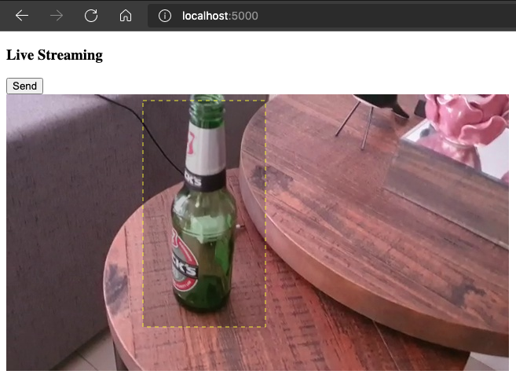
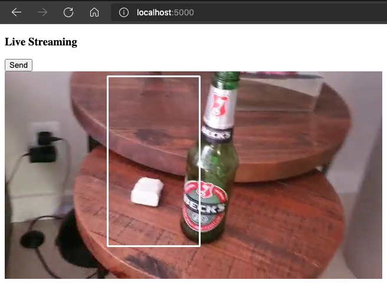

# OpenCV Web

A very simple example to run Python's OpenCV in the backend and interact with the user with javascrit in the frontend.  

This example steps:
* It displays a video file loaded with opencv in the web page streaming it as a jpg sequence  
* The video stops at frame 10  
* You can make a rectangle selection at the frame (with Javascript)  
  

* When you click **send** (or refresh the page) the rectangle attributes are send to python with http GET  
* The rectangle is painted at frames by OpenCV  
  

# Run locally
## Requirements
*Suggestion: Use [pyenv + pipenv](https://dev.to/spacerockmedia/the-python-virtual-environment-with-pyenv-pipenv-3mlo) to manage python and libs versions  

[](https://www.python.org/ftp/python/3.7.9)  
[](https://pipenv.pypa.io/en/latest/install)  
[](https://docs.opencv.org/4.5.3/da/df6/tutorial_py_table_of_contents_setup.html)  

## Run
Install dependencies  
```bash
pipenv install
```
Enable Virtual Enviroment  
```bash
pipenv shell
```
Run Flask  
```bash
python3 -m flask run
```

# Run Container
## Requirements
[](https://www.python.org/ftp/python/3.7.9)  

Build image  
```bash
docker build -t opencvweb .
```
Run container  
```bash
docker run -d --name opencvweb -p 5000:5000 opencvweb
```